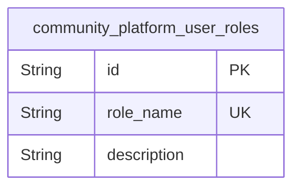
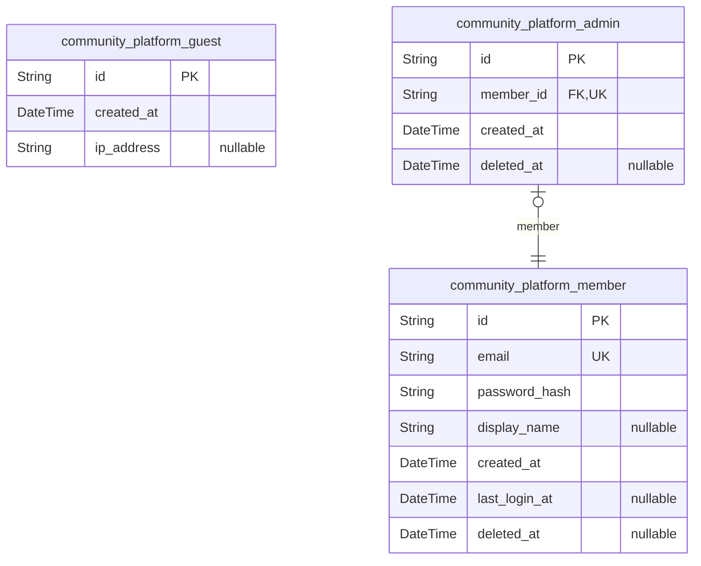
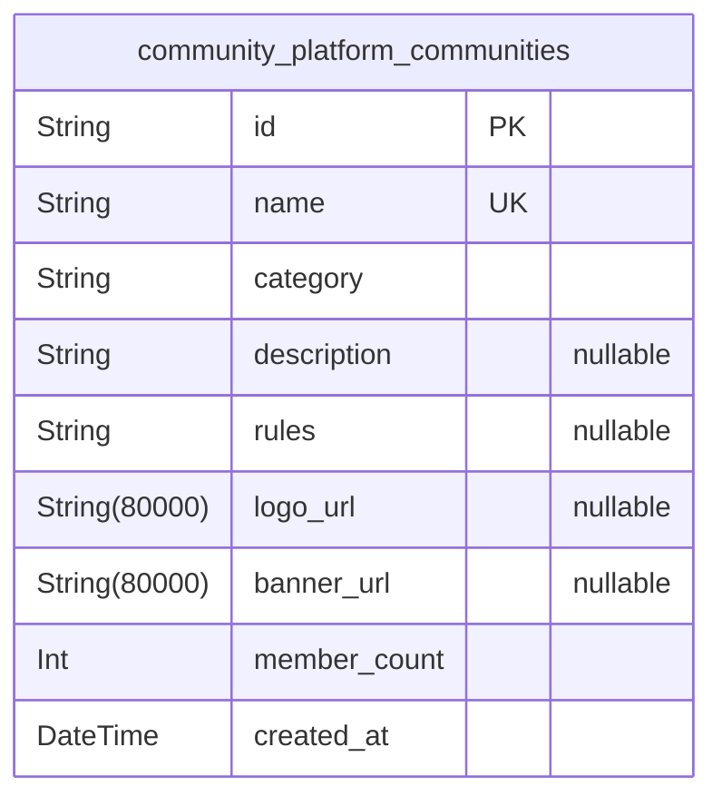
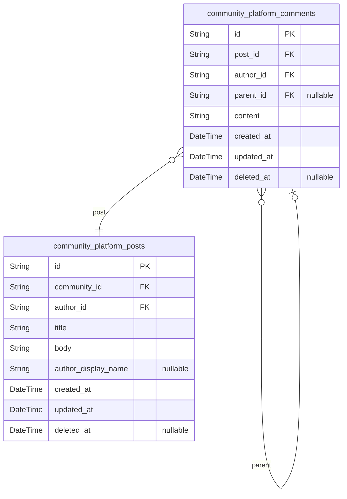
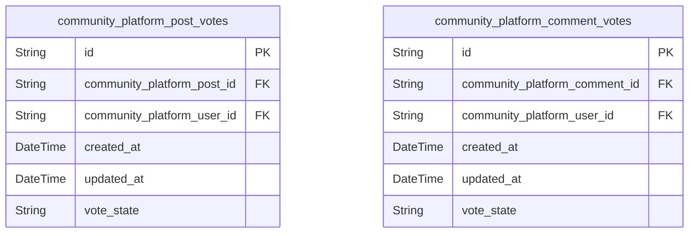
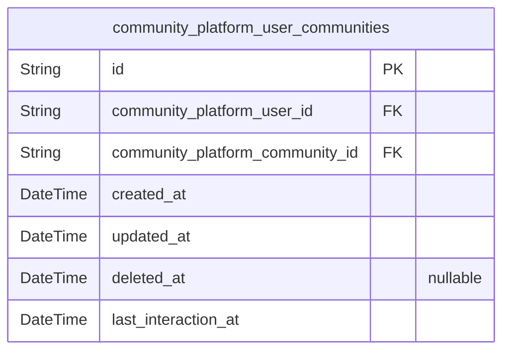
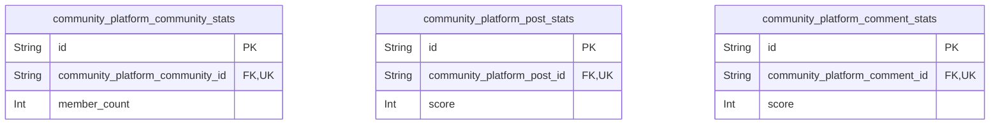
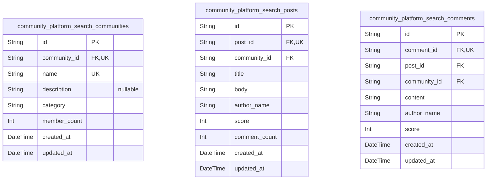

# Prisma Markdown

> Generated by [`prisma-markdown`](https://github.com/samchon/prisma-markdown)

- [Systematic](#systematic)
- [Actors](#actors)
- [Communities](#communities)
- [Posts](#posts)
- [Votes](#votes)
- [Memberships](#memberships)
- [Analytics](#analytics)
- [default](#default)

## Systematic

### `community_platform_user_roles`

Defines the role-based access control system for the community platform.
Each role (guest, member, admin) represents a distinct permission profile
that determines what actions a user can perform in the system. This table
persists the immutable role definitions that govern platform behavior,
such as who can create communities, post content, or moderate
transactions. Referenced by user tables to enforce access control
policies.

Properties as follows:

- `id`: Primary Key.
- `role_name`
  > The precise role identifier that defines the permission set. Must be one
  > of: 'guest', 'member', or 'admin'. This value is immutable and used to
  > enforce access control rules throughout the system.
- `description`
  > A human-readable description of the role's permissions and
  > responsibilities within the platform. Clearly defines what actions users
  > with this role can perform.

## Actors

### `community_platform_guest`

Guest account entity that represents unauthenticated users with read-only
access to public content. This table enforces that all operations
requiring authentication are blocked at the data layer, and no
user-specific state is persisted. Used to prevent unauthorized access to
write operations.

Properties as follows:

- `id`: Primary Key.
- `created_at`
  > Timestamp when the guest session began. This field tracks access time for
  > analytics but does not store persistent user state.
- `ip_address`
  > IP address of the guest user. Used for analytics and spam detection. Not
  > used for authentication.

### `community_platform_member`

Member account entity that represents authenticated users with full
participation rights including posting, commenting, voting, and joining
communities. This table stores authentication credentials and user
preferences. Member accounts own all content they create and can
edit/delete only their own content.

Properties as follows:

- `id`: Primary Key.
- `email`
  > User's email address used for authentication and communication. Must be
  > unique across all members.
- `password_hash`
  > Hashed password for authentication. Never stores plain text passwords.
  > Required for member login according to authentication requirements.
- `display_name`
  > Optional display name for posts and comments. If empty, system defaults
  > to 'Anonymous'. Length constrained to 32 characters by business rules.
- `created_at`
  > Timestamp when the member account was created. Used for user onboarding
  > analytics and account age calculation.
- `last_login_at`
  > Timestamp of the member's last successful login. Used to determine
  > session validity and user activity status.
- `deleted_at`
  > Soft delete timestamp. When set, the member account is considered
  > deactivated but persisted for audit trail purposes. Required for soft
  > delete capability per requirements.

### `community_platform_admin`

Admin account entity that represents privileged members with elevated
permissions including moderation and content deletion. Admins inherit all
member privileges and can override content ownership restrictions. This
table ensures admin privileges are isolated and auditable, with admin
role enforced server-side.

Properties as follows:

- `id`: Primary Key.
- `member_id`
  > Reference to the underlying member account. Admin is a privilege level
  > granted to an existing member. [community_platform_member.id](#community_platform_member).
- `created_at`
  > Timestamp when admin privileges were granted. Used for audit trail and
  > privilege duration analysis.
- `deleted_at`
  > Soft delete timestamp. When set, admin privileges are revoked but audit
  > trail is preserved. Required for soft delete capability per requirements.

## Communities

### `community_platform_communities`

A sub-community on the platform where users gather around a specific
topic. Communities have unique names, categories, and optional metadata
like description, rules, logo, and banner. Member count is tracked in
real-time. Communities are created by members and can be deleted by
admins or creators. All community data is immutable except for
description, logo, banner, and rules (by creator).

Properties as follows:

- `id`: Primary Key.
- `name`
  > Unique alphanumeric identifier for the community. May contain hyphens (-)
  > and underscores (_). Must be 5 to 64 characters long. Immutable after
  > creation.
- `category`
  > The predefined category this community belongs to. Must be one of: ["Tech
  > & Programming", "Science", "Movies & TV", "Games", "Sports", "Lifestyle &
  > Wellness", "Study & Education", "Art & Design", "Business & Finance",
  > "News & Current Affairs"].
- `description`
  > Optional summary text with a maximum length of 500 characters. Describes
  > the community's purpose and rules.
- `rules`
  > Optional community rules in plain text format. Each rule is one line. Up
  > to 20 rules allowed. Only the top 5 are displayed on UI.
- `logo_url`
  > URL to the community's logo image. Supports PNG, JPG, SVG formats.
  > Optional. Defaults to placeholder if not provided.
- `banner_url`
  > URL to the community's banner image. Supports PNG, JPG formats. Optional.
  > Defaults to placeholder if not provided.
- `member_count`
  > Current number of users who have joined this community. Updated in
  > real-time when users join or leave. Displayed as "1k" for ≥1000, "1m" for
  > ≥1000000.
- `created_at`
  > Timestamp when this community was created. Used for sorting in "Recently
  > Created" search and internal audit tracking.

## Posts

### `community_platform_posts`

Main content entities created by members within communities. Posts are
text-only with title and body, linked to a community and author.
Ownership is account-based: only the author can edit or delete. Cascading
delete on community removal. Created_at and updated_at track lifecycle;
deleted_at enables soft delete. Comment count and score are maintained in
separate post_stats table; no denormalized counts here to ensure 3NF
compliance.

Properties as follows:

- `id`: Primary Key.
- `community_id`
  > Community to which this post belongs. {@link
  > community_platform_communities.id}.
- `author_id`: Member who authored this post. [community_platform_member.id](#community_platform_member).
- `title`
  > Post title. Must be between 5 and 120 characters. Plain text only, no
  > HTML or formatting.
- `body`
  > Post body content. Must be between 10 and 10,000 characters. Plain text
  > with \n line breaks only, no scripts or executable content.
- `author_display_name`
  > Optional display name for the author. If empty or null, system displays
  > "Anonymous". Maximum 32 characters.
- `created_at`: Timestamp when the post was created. Always set on creation.
- `updated_at`: Timestamp when the post was last updated. Updated on each edit.
- `deleted_at`
  > Soft delete timestamp. If null, post is active. If set, post is deleted
  > and hidden from feeds.

### `community_platform_comments`

Nested comments on posts or other comments. Each comment has a single
parent (post or comment) and is authored by a member. Comments support
unlimited nesting, ordered by creation time. Only the author can
edit/delete. Soft delete supported via deleted_at. All content is plain
text. Comment counts are stored in separate comment_stats table to
maintain normalization. This is a primary entity because users require
independent comment management: search by user, moderation workflows,
cross-post visibility.

Properties as follows:

- `id`: Primary Key.
- `post_id`
  > Post that this comment belongs to. CASCADE DELETE when post is removed.
  > [community_platform_posts.id](#community_platform_posts).
- `author_id`: Member who authored this comment. [community_platform_member.id](#community_platform_member).
- `parent_id`
  > Parent comment this comment replies to. Self-referential relationship. If
  > null, comment is top-level (directly under post). {@link
  > community_platform_comments.id}.
- `content`
  > Full text content of the comment. Must be between 2 and 2,000 characters.
  > Plain text with \n line breaks only. No HTML, code, or executable content
  > permitted.
- `created_at`: Timestamp when the comment was created. Always set on creation.
- `updated_at`: Timestamp when the comment was last updated. Updated on each edit.
- `deleted_at`
  > Soft delete timestamp. If null, comment is active. If set, comment is
  > deleted and hidden from views.

## Votes

### `community_platform_post_votes`

Tracks individual upvotes and downvotes by users on posts. Each record
represents a single vote from a user on a specific post, enforcing
uniqueness to ensure one vote per user per post. The vote state can be
upvote, downvote, or none (implicitly tracked by the absence of a
record). This empowers efficient score calculation (upvotes - downvotes)
and prevents self-voting through foreign key constraints to
community_platform_posts.

Properties as follows:

- `id`: Primary Key.
- `community_platform_post_id`: The post that was voted on. [community_platform_posts.id](#community_platform_posts).
- `community_platform_user_id`: The user who cast this vote. [community_platform_member.id](#community_platform_member).
- `created_at`
  > The timestamp when the vote was cast. Used for ordering and determining
  > vote age.
- `updated_at`
  > The timestamp when the vote was last updated (e.g., changed from upvote
  > to downvote).
- `vote_state`
  > The current state of the vote ('upvote' or 'downvote'). A record's
  > existence implies a vote, and this field defines its direction.
  > Implicitly, 'none' is represented by the absence of a record.

### `community_platform_comment_votes`

Tracks individual upvotes and downvotes by users on comments. Each record
represents a single vote from a user on a specific comment, enforcing
uniqueness to ensure one vote per user per comment. The vote state can be
upvote, downvote, or none (implicitly tracked by the absence of a
record). This empowers efficient score calculation (upvotes - downvotes)
and prevents self-voting through foreign key constraints to
community_platform_comments.

Properties as follows:

- `id`: Primary Key.
- `community_platform_comment_id`: The comment that was voted on. [community_platform_comments.id](#community_platform_comments).
- `community_platform_user_id`: The user who cast this vote. [community_platform_member.id](#community_platform_member).
- `created_at`
  > The timestamp when the vote was cast. Used for ordering and determining
  > vote age.
- `updated_at`
  > The timestamp when the vote was last updated (e.g., changed from upvote
  > to downvote).
- `vote_state`
  > The current state of the vote ('upvote' or 'downvote'). A record's
  > existence implies a vote, and this field defines its direction.
  > Implicitly, 'none' is represented by the absence of a record.

## Memberships

### `community_platform_user_communities`

Junction table tracking the dynamic relationship between users and
communities. This table enables the 'Recent Communities' list
functionality and content filtering for the home feed. Each record
represents a user's membership status in a community and tracks when the
user last interacted with that community (through join, post, comment, or
vote). The record is soft-deleted when a user leaves a community,
enabling rejoining and maintaining activity history. This is a supporting
table managed exclusively through user actions on community pages, not
independently.

Key Business Rules:
- Users can join and leave communities dynamically
- The last_interaction_at field determines ordering in the 'Recent
Communities' list
- active status is tracked through deleted_at (not is_joined)
- This table must support efficient queries for 'Recent Communities' list
(top 5 by last_interaction_at)
- This table supports home feed filtering by excluding posts from
communities where deleted_at is not null
- This table has no independent API endpoints - managed only through
community join/leave actions in UI

@link community_platform_users.id - The user who has established membership
@link community_platform_communities.id - The community the user is
associated with

Properties as follows:

- `id`: Primary Key.
- `community_platform_user_id`
  > The user who has established membership. {@link
  > community_platform_member.id}.
- `community_platform_community_id`
  > The community the user is associated with. {@link
  > community_platform_communities.id}.
- `created_at`
  > Timestamp when the membership relationship was established. This is
  > immutable once set.
- `updated_at`
  > Timestamp of the last update to this membership record. Updated on any
  > interaction (join, post, comment, vote).
- `deleted_at`
  > Timestamp when the user left the community. When null, the membership is
  > active; when set, the membership is inactive. Used for soft deletion to
  > maintain history and enable rejoining.
- `last_interaction_at`
  > Timestamp of the user's most recent activity within this community. This
  > field is updated when the user joins, posts, comments, or votes. Used to
  > sort and maintain the 'Recent Communities' list with the most recently
  > active communities appearing first.

## Analytics

### `community_platform_community_stats`

Denormalized statistics counter for member count of communities. This
table is updated atomically on every user join or leave action to avoid
expensive COUNT queries on the community_platform_user_communities
junction table during feed rendering. Used by the home page to display
member counts as 1k, 10k, etc. This is a subsidiary table with
denormalized data that supports high-frequency read operations.

Properties as follows:

- `id`: Primary Key.
- `community_platform_community_id`
  > Reference to the community this statistic belongs to. {@link
  > community_platform_communities.id}.
- `member_count`
  > The current number of members in this community. Updated atomically on
  > every join/leave action. Never exceeds 10M and is formatted as 1k, 10k,
  > 1m in UI.

### `community_platform_post_stats`

Denormalized statistics counter for total score (upvotes minus downvotes)
of posts. This table is updated atomically on every vote action
(upvote/downvote/toggle) to avoid expensive COUNT queries on the
community_platform_post_votes table during top-sorting of feeds and
global latest sidebar. Used to calculate and display the score in posts
without performing joins or aggregations at query time. This is a
subsidiary table with denormalized data.

Properties as follows:

- `id`: Primary Key.
- `community_platform_post_id`
  > Reference to the post this statistic belongs to. {@link
  > community_platform_posts.id}.
- `score`
  > The total score of the post calculated as (upvotes - downvotes). Updated
  > atomically on every vote event to optimize high-frequency sorting by
  > "Top" in feeds and Global Latest sidebar.

### `community_platform_comment_stats`

Denormalized statistics counter for total score (upvotes minus downvotes)
of comments. This table is updated atomically on every vote action
(upvote/downvote/toggle) to avoid expensive COUNT queries on the
community_platform_comment_votes table during comment rendering. Used to
calculate and display comment score efficiently on post detail pages and
search results. This is a subsidiary table with denormalized data.

Properties as follows:

- `id`: Primary Key.
- `community_platform_comment_id`
  > Reference to the comment this statistic belongs to. {@link
  > community_platform_comments.id}.
- `score`
  > The total score of the comment calculated as (upvotes - downvotes).
  > Updated atomically on every vote event to optimize high-frequency display
  > of comment scores in threaded discussions.

## default

### `community_platform_search_communities`

Materialized view for full-text search of community names and
descriptions. This is a denormalized copy of
community_platform_communities data, optimized for search performance.
Only updated via system triggers when source communities are created,
updated or deleted. Not directly modifiable by users.

Properties as follows:

- `id`: Primary Key.
- `community_id`
  > Reference to the source community in community_platform_communities.
  > [community_platform_communities.id](#community_platform_communities).
- `name`
  > The unique name of the community (e.g., 'ai' or 'gaming'), used for exact
  > and fuzzy search matching.
- `description`
  > The optional description of the community, included in full-text search
  > to match user queries about community topics.
- `category`
  > The category designation of the community from the predefined list (e.g.,
  > 'Tech & Programming', 'Science'). Used for category-based filtering in
  > search.
- `member_count`
  > The current count of members in this community (1k, 10k, 1m abbreviated).
  > Used for popularity ranking in search results.
- `created_at`
  > Timestamp of when this search view entry was created or last updated from
  > the source community.
- `updated_at`
  > Timestamp of when this search view entry was last updated from the source
  > community.

### `community_platform_search_posts`

Materialized view for full-text search of post titles and bodies. This is
a denormalized copy of community_platform_posts data, optimized for
search performance. Only updated via system triggers when source posts
are created, updated or deleted. Not directly modifiable by users.

Properties as follows:

- `id`: Primary Key.
- `post_id`
  > Reference to the source post in community_platform_posts. {@link
  > community_platform_posts.id}.
- `community_id`
  > Reference to the community where this post was created
  > (community_platform_communities). {@link
  > community_platform_communities.id}.
- `title`
  > The title of the post (5-120 characters), used for exact and fuzzy search
  > matching.
- `body`
  > The main content of the post (10-10,000 characters), included in
  > full-text search to match user queries about post content.
- `author_name`
  > The display name of the author (or 'Anonymous' if not set), used to
  > search for content by author.
- `score`
  > The calculated score of the post (upvotes - downvotes), used for Top sort
  > ranking in search results.
- `comment_count`
  > The number of comments on this post, used for popularity ranking in
  > search results.
- `created_at`
  > Timestamp of when this search view entry was created or last updated from
  > the source post.
- `updated_at`
  > Timestamp of when this search view entry was last updated from the source
  > post.

### `community_platform_search_comments`

Materialized view for full-text search of comment content. This is a
denormalized copy of community_platform_comments data, optimized for
search performance. Only updated via system triggers when source comments
are created, updated or deleted. Not directly modifiable by users.

Properties as follows:

- `id`: Primary Key.
- `comment_id`
  > Reference to the source comment in community_platform_comments. {@link
  > community_platform_comments.id}.
- `post_id`
  > Reference to the post this comment belongs to (community_platform_posts).
  > [community_platform_posts.id](#community_platform_posts).
- `community_id`
  > Reference to the community where this comment was made
  > (community_platform_communities). {@link
  > community_platform_communities.id}.
- `content`
  > The text content of the comment (2-2,000 characters), used for full-text
  > search matching.
- `author_name`
  > The display name of the comment author (or 'Anonymous' if not set), used
  > to search for comments by author.
- `score`
  > The calculated score of the comment (upvotes - downvotes), used for
  > ranking in search results.
- `created_at`
  > Timestamp of when this search view entry was created or last updated from
  > the source comment.
- `updated_at`
  > Timestamp of when this search view entry was last updated from the source
  > comment.
