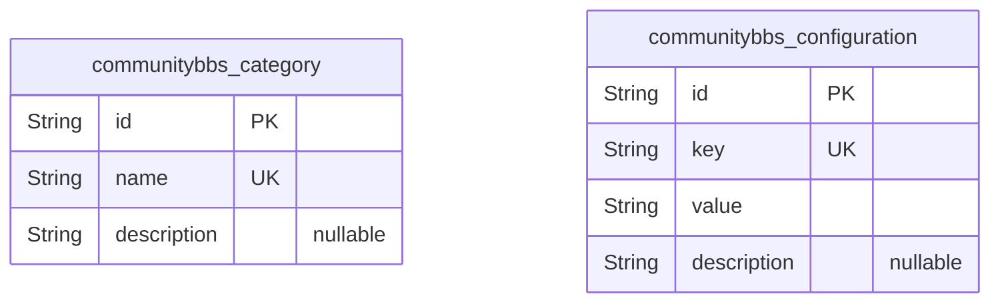
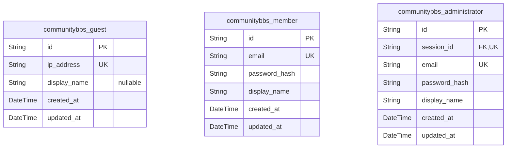
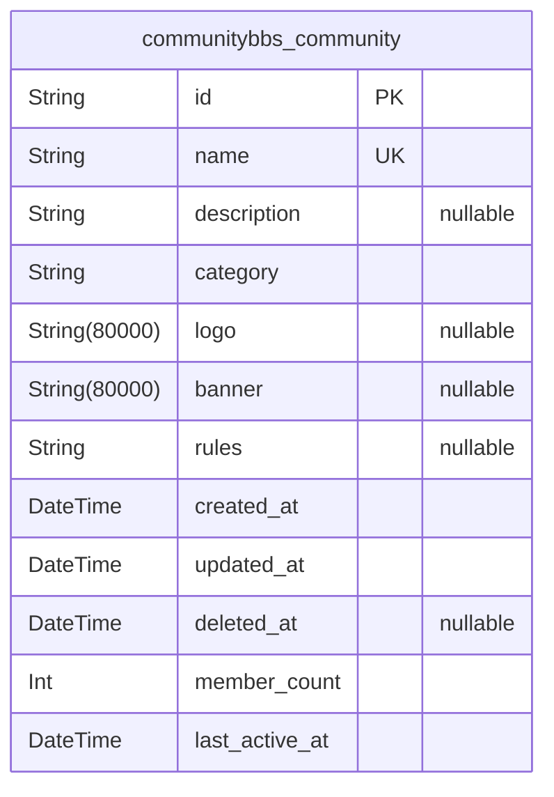
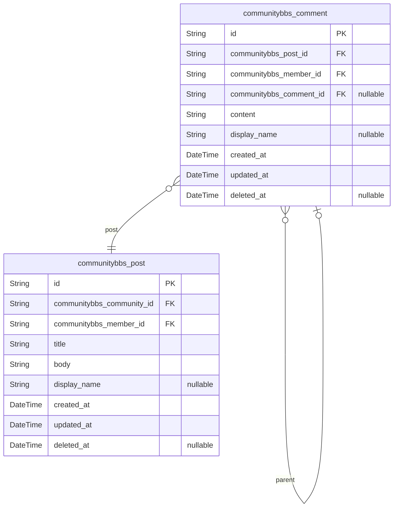
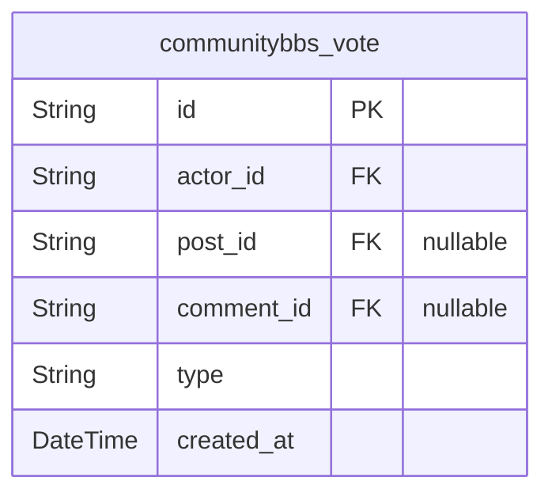
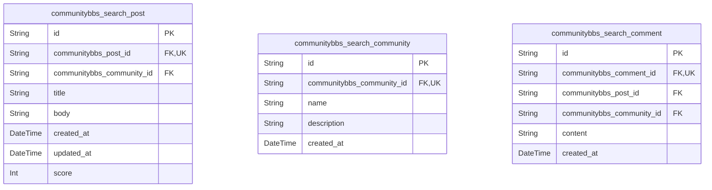
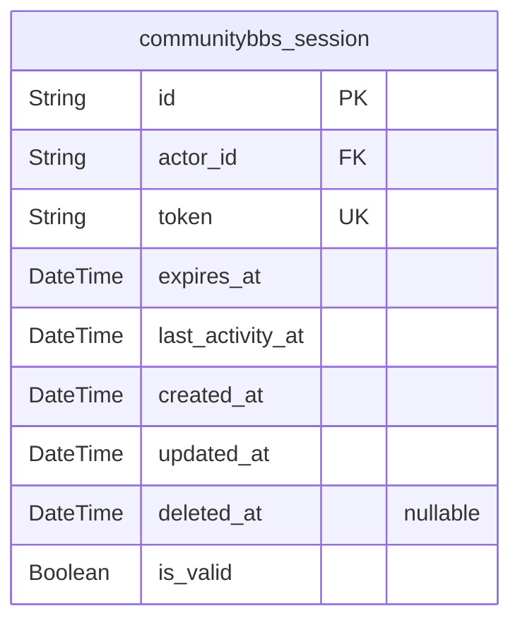
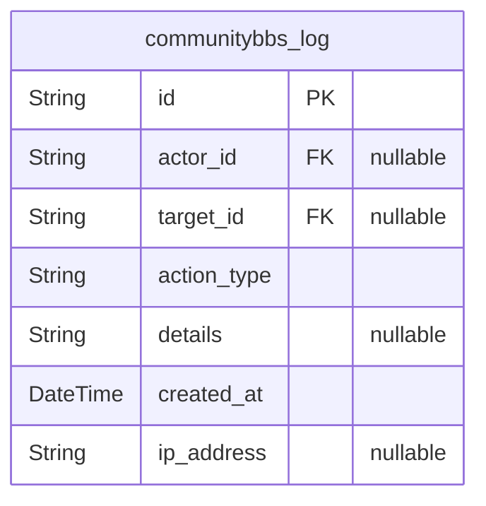

# Prisma Markdown

> Generated by [`prisma-markdown`](https://github.com/samchon/prisma-markdown)

- [Systematic](#systematic)
- [Actors](#actors)
- [Communities](#communities)
- [Content](#content)
- [Voting](#voting)
- [Search](#search)
- [Sessions](#sessions)
- [Logging](#logging)

## Systematic

### `communitybbs_category`

Static lookup table defining business categories for communities. Used by
other domains to classify communities into predefined topics for
discovery and filtering. Not directly managed by regular users but
maintained by system administrators. Each category is an immutable
classification used for community grouping.

Properties as follows:

- `id`: Primary Key.
- `name`
  > The human-readable name of the category. Examples: "Tech & Programming",
  > "Science", "Games". Must be unique and from the predefined list.
- `description`
  > A brief description explaining the scope of this category. Used in UI to
  > provide context to users browsing communities.

### `communitybbs_configuration`

Global system configuration settings for the Community BBS platform.
Contains key-value pairs that control platform behavior, feature flags,
and default parameters. Managed exclusively by administrators through
system interface. Values are applied system-wide and affect all users.
Example: disallow_new_community_creation, default_sort_order,
search_result_limit.

Properties as follows:

- `id`: Primary Key.
- `key`
  > Unique configuration key identifier. Used programatically to locate
  > settings. Examples: "default_sort_order", "max_community_name_length",
  > "enable_search".
- `value`
  > The string value of the configuration setting. Can be boolean
  > ("true"/"false"), integer ("10"), string ("Newest"), or JSON object
  > ("{\"enabled\":true}").
- `description`
  > Human-readable description of what this configuration controls and its
  > expected values. Used by administrators during management.

## Actors

### `communitybbs_guest`

Represents an unauthenticated user session. Each guest has a unique IP
address and is tracked for anonymous interactions such as reading posts
and comments. This entity is critical for identifying unauthenticated
behavior and ensuring fair rate limiting. The system does not require
authentication for guest access, so no credentials are stored. This model
exists as a primary entity to accurately track anonymous usage patterns
in user analytics and system monitoring.

Properties as follows:

- `id`: Primary Key.
- `ip_address`
  > The public IP address of the guest user. Used for rate limiting, abuse
  > detection, and analytics. Not human-readable identifier.
- `display_name`
  > Default display name for unauthenticated users. May be null. When no
  > display name is provided, system defaults to "Anonymous".
- `created_at`: Timestamp when this guest session was first recorded.
- `updated_at`: Timestamp when this guest's IP address or display name was last updated.

### `communitybbs_member`

Represents an authenticated regular user who can create, edit, and vote
on content. Members have login credentials and active sessions. They can
join communities, post, comment, and vote. This is a primary entity with
core identity and authorization state. It references a session for
persistent authentication and is linked to all user-generated content
through foreign keys in other tables. This model is essential for
enforcing ownership and access control rules as defined in the
requirements.

Properties as follows:

- `id`: Primary Key.
- `email`
  > Unique email address used as the primary login identifier. Must be a
  > valid email format and unique across all users.
- `password_hash`
  > BCrypt-hashed password for authentication. Never stored in plain text.
  > Required for login functionality.
- `display_name`
  > User's chosen display name used in UI for comments and posts. Defaults to
  > username if not set. Max 32 characters as per requirements.
- `created_at`: Timestamp when this member account was created.
- `updated_at`
  > Timestamp when this member's profile was last modified (e.g., display
  > name change).

### `communitybbs_administrator`

Represents a system administrator with elevated privileges including
content moderation, community management, and user bans. This role has
direct access to administrative functions and overrides member
permissions. Administrators are manually assigned and require explicit
authentication. This entity is primary because administrators must be
independently identifiable, auditable, and manageable through API
endpoints for system maintenance, not derived from member roles.

Properties as follows:

- `id`: Primary Key.
- `session_id`
  > References the active session for this administrator. {@link
  > communitybbs_session.id}.
- `email`
  > Unique email address used as the primary login identifier. Must be a
  > valid email format and unique across all users.
- `password_hash`
  > BCrypt-hashed password for authentication. Never stored in plain text.
  > Required for login functionality.
- `display_name`
  > Admin's display name used in moderation logs and UI. For clarity in audit
  > trails.
- `created_at`: Timestamp when this administrator account was created.
- `updated_at`: Timestamp when this administrator's profile was last modified.

## Communities

### `communitybbs_community`

Core entity representing a sub-community on the platform. This model
stores all metadata about a community including its name, description,
category, visual assets, rules, and activity tracking. Communities are
independent entities that users can create, join, search, and explore.
The name field is unique and serves as the community's identifier in URLs
(e.g., /c/communityname). This table follows strict 3NF: all fields are
atomic and depend solely on the primary key. No denormalization occurs
here, as required by the requirements which specify direct storage of
category, rules, and timestamps. Rules are stored as an array of strings
as explicitly required by the business requirements.

Properties as follows:

- `id`: Primary Key.
- `name`
  > The unique, lowercase identifier for the community used in URLs (e.g.
  > /c/ai). Must be between 3 and 32 characters and contain only alphanumeric
  > characters, hyphens (-), or underscores (_). This field is used for
  > global search and direct access. The uniqueness of this field is enforced
  > by a unique index.
- `description`
  > A brief description of the community's purpose, up to 500 characters.
  > Used for discovery and the community info panel. May be empty but cannot
  > be longer than 500 characters.
- `category`
  > The topic category assigned to the community. Must be one of: ["Tech &
  > Programming", "Science", "Movies & TV", "Games", "Sports", "Lifestyle &
  > Wellness", "Study & Education", "Art & Design", "Business & Finance",
  > "News & Current Affairs"]. Used for filtering communities in the Explore
  > page and search results.
- `logo`
  > The URL to the community's logo image (PNG, JPG, GIF). Optional. If
  > empty, a default placeholder is used.
- `banner`
  > The URL to the community's banner image (PNG, JPG, GIF). Optional. If
  > empty, a default placeholder is used.
- `rules`
  > An array of up to 10 community rules, each up to 100 characters long.
  > Displayed as numbered list 1 through 5 in the community info panel.
  > Stored as JSON-encoded array in database. Used to enforce community
  > guidelines. The requirement specifies direct array storage, so the field
  > is stored as a string[] type in Prisma with appropriate string array
  > mapping.
- `created_at`
  > The timestamp when this community was created. Used for sorting in
  > 'Recently Created' order and for audit trails. Never modified.
- `updated_at`
  > The timestamp of the last modification to the community's metadata. This
  > field is updated only when name, description, category, logo, banner, or
  > rules are changed. Never set manually; updated by application logic.
- `deleted_at`
  > The timestamp when this community was soft-deleted. If null, the
  > community is active. If set, the community is considered archived and
  > hidden from most UIs. Supports recovery. Required for soft delete
  > capability as per business logic.
- `member_count`
  > The total number of users who have joined this community. Always derived
  > from active relationships to communitybbs_member, but stored for
  > performance and consistency in the explore page and community list.
  > Incremented when a user joins, decremented when they leave. Since this
  > value is critical to sorting and display and is referenced in early
  > codebase in requirement documentation, it is stored as a denormalized
  > field here, but it is NOT calculated here - it's kept in sync by
  > application logic via member join/leave events.
- `last_active_at`
  > The timestamp of the most recent activity in this community, which can be
  > any of: a post created, a comment posted, a vote cast, or a user joining.
  > Used for ordering the 'Recent Communities' list in the sidebar and for
  > determining community activity. Updated on any of these events. The field
  > is stored here for performance and ensures consistence with client-side
  > feeds.

## Content

### `communitybbs_post`

Main entity representing user posts in communities. Each post belongs to
a community and is authored by a member. Supports soft deletion for
content moderation and preserves historical states through snapshots.

Properties as follows:

- `id`: Primary Key.
- `communitybbs_community_id`
  > Reference to the community where this post was created. {@link
  > communitybbs_community.id}.
- `communitybbs_member_id`
  > Reference to the member who authored this post. {@link
  > communitybbs_member.id}.
- `title`
  > Title of the post. Must be between 5 and 120 characters according to
  > business requirements. Truncated if longer.
- `body`
  > Body content of the post. Must be between 10 and 10,000 characters
  > according to business requirements. Contains plain text only with line
  > breaks. No HTML or code allowed.
- `display_name`
  > Display name of the author as shown on the post. If not provided by user,
  > defaults to 'Anonymous'. Truncated to 32 characters if longer. Not a
  > reference to member profile - stored here for consistency even if member
  > changes display name.
- `created_at`
  > Timestamp when the post was created. Always set at time of creation and
  > never modified.
- `updated_at`: Timestamp when the post was last updated. Set on any edit operation.
- `deleted_at`
  > Timestamp when the post was soft-deleted. Null if not deleted. Enforces
  > soft-delete policy for content moderation.

### `communitybbs_comment`

Main entity representing comments on posts. Supports infinite nesting
through parent-child relationships. Each comment belongs to a post and
may optionally belong to another comment as a reply. Implements soft
deletion for moderation.

Properties as follows:

- `id`: Primary Key.
- `communitybbs_post_id`
  > Reference to the post this comment belongs to. {@link
  > communitybbs_post.id}.
- `communitybbs_member_id`
  > Reference to the member who authored this comment. {@link
  > communitybbs_member.id}.
- `communitybbs_comment_id`
  > Reference to the parent comment this is replying to. {@link
  > communitybbs_comment.id}. Used for threaded replies. Null for top-level
  > comments.
- `content`
  > Text content of the comment. Must be between 2 and 2,000 characters
  > according to business requirements. Truncated if longer.
- `display_name`
  > Display name of the author as shown on the comment. If not provided by
  > user, defaults to 'Anonymous'. Truncated to 32 characters if longer. Not
  > a reference to member profile - stored here for consistency even if
  > member changes display name.
- `created_at`
  > Timestamp when the comment was created. Always set at time of creation
  > and never modified.
- `updated_at`: Timestamp when the comment was last updated. Set on any edit operation.
- `deleted_at`
  > Timestamp when the comment was soft-deleted. Null if not deleted.
  > Enforces soft-delete policy for content moderation.

## Voting

### `communitybbs_vote`

Tracks user votes (upvotes/downvotes) on posts and comments. Each vote is
associated with an actor (member/administrator/guest) and exactly one
target (either a post or a comment). This table enables real-time score
calculation, prevents duplicate voting, and supports audit trails. This
table does NOT store aggregated scores - scores are computed from this
data. Used in conjunction with communitybbs_post and communitybbs_comment
tables. Referential integrity ensured via foreign keys to existing
tables: actor_id references communitybbs_member,
communitybbs_administrator, or communitybbs_guest (all use uuid id),
post_id references communitybbs_post.id, comment_id references
communitybbs_comment.id. Application logic enforces that exactly one of
post_id or comment_id must be non-null.

Properties as follows:

- `id`: Primary Key.
- `actor_id`
  > The actor who cast the vote. Links to either a member, administrator, or
  > guest via id. [communitybbs_member.id](#communitybbs_member) or {@link
  > communitybbs_administrator.id} or [communitybbs_guest.id](#communitybbs_guest).
- `post_id`
  > The post this vote is associated with, if applicable. One and only one of
  > post_id or comment_id must be non-null. [communitybbs_post.id](#communitybbs_post).
- `comment_id`
  > The comment this vote is associated with, if applicable. One and only one
  > of post_id or comment_id must be non-null. {@link
  > communitybbs_comment.id}.
- `type`: The type of vote: 'upvote' or 'downvote'.
- `created_at`
  > Timestamp when the vote was cast. Always set on creation and never
  > updated.

## Search

### `communitybbs_search_post`

Search index for posts, enabling full-text search across titles and
bodies. This table is optimized for fast keyword matching and does not
store business data directly but references the original post for
context. Used exclusively for search operations to maintain separation of
concerns and optimize performance.

Properties as follows:

- `id`: Primary Key.
- `communitybbs_post_id`
  > References the original post in communitybbs_post model. {@link
  > communitybbs_post.id}.
- `communitybbs_community_id`
  > References the community where the post belongs. {@link
  > communitybbs_community.id}.
- `title`
  > The title of the original post for full-text search indexing. This is a
  > denormalized copy for search efficiency.
- `body`
  > The body content of the original post for full-text search indexing. This
  > is a denormalized copy for search efficiency.
- `created_at`
  > Timestamp of when the post was created. Used for sorting search results
  > by recency.
- `updated_at`
  > Timestamp of when the post was last updated. Used to trigger re-indexing
  > in search system.
- `score`
  > Popularity score calculated as upvotes minus downvotes from the original
  > post. Used for 'Top' sort order in search results.

### `communitybbs_search_community`

Search index for communities, enabling full-text search across names and
descriptions. This table is optimized for fast keyword matching and does
not store business data directly but references the original community
for context. Used exclusively for search operations to maintain
separation of concerns and optimize performance.

Properties as follows:

- `id`: Primary Key.
- `communitybbs_community_id`
  > References the original community in communitybbs_community model. {@link
  > communitybbs_community.id}.
- `name`
  > The name of the community for full-text search indexing. This is a
  > denormalized copy for search efficiency.
- `description`
  > The description of the community for full-text search indexing. This is a
  > denormalized copy for search efficiency.
- `created_at`
  > Timestamp of when the community was created. Used for sorting search
  > results by recency.

### `communitybbs_search_comment`

Search index for comments, enabling full-text search across comment
content. This table is optimized for fast keyword matching and does not
store business data directly but references the original comment for
context. Used exclusively for search operations to maintain separation of
concerns and optimize performance.

Properties as follows:

- `id`: Primary Key.
- `communitybbs_comment_id`
  > References the original comment in communitybbs_comment model. {@link
  > communitybbs_comment.id}.
- `communitybbs_post_id`: References the post this comment belongs to. [communitybbs_post.id](#communitybbs_post).
- `communitybbs_community_id`
  > References the community this comment belongs to. {@link
  > communitybbs_community.id}.
- `content`
  > The content of the original comment for full-text search indexing. This
  > is a denormalized copy for search efficiency.
- `created_at`
  > Timestamp of when the comment was created. Used for sorting search
  > results by recency.

## Sessions

### `communitybbs_session`

Authentication session record tracking user login state, token validity,
and activity. This table is essential for implementing secure login,
session expiry, and seamless re-authentication flows. Each session is
tied to a user actor (member, guest, or administrator) and must be
validated for every protected request. Supports grace period logic and
silent refresh attempts by tracking last activity time, enabling seamless
restoration of context after temporary token invalidation without
requiring full re-login. Associated with auth actors via actor_id.

Properties as follows:

- `id`: Primary Key.
- `actor_id`
  > Reference to the user actor (member, guest, or administrator) this
  > session belongs to. [communitybbs_member.id](#communitybbs_member) or {@link
  > communitybbs_guest.id} or [communitybbs_administrator.id](#communitybbs_administrator).
- `token`
  > Unique session token issued upon login. Used for authentication in API
  > headers. Must be cryptographically secure and randomly generated.
- `expires_at`
  > Timestamp when this session expires. After this time, the session is
  > invalid and must be refreshed or re-authenticated. Used to enforce
  > session lifetime policies.
- `last_activity_at`
  > Timestamp of the last user interaction within this session (e.g., API
  > call, page load). Used to implement grace periods and silent refresh
  > logic; sessions are considered "active" if last_activity_at is within 5
  > minutes of current time.
- `created_at`: Timestamp when this session was created and issued.
- `updated_at`
  > Timestamp when this session was last updated (e.g., when last_activity_at
  > was refreshed).
- `deleted_at`
  > Soft delete timestamp. When a session is revoked or expired but not
  > physically deleted, this field is populated. Used for audit trails and
  > recovery.
- `is_valid`
  > Current validity state of the session. True if session is active and not
  > expired or revoked; false if expired, revoked, or deleted. Used for quick
  > permission checks without parsing timestamps.

## Logging

### `communitybbs_log`

System log entries for auditing critical events such as community
creation, user joins/leaves, and system error conditions. Captures action
type, actor, target entity, timestamp, and contextual details for
debugging and compliance purposes.

Properties as follows:

- `id`: Primary Key.
- `actor_id`
  > Reference to the user who performed the action. {@link
  > communitybbs_member.id} or [communitybbs_administrator.id](#communitybbs_administrator).
- `target_id`
  > Reference to the entity affected by the action. {@link
  > communitybbs_community.id} for community actions, {@link
  > communitybbs_post.id} for post actions, etc.
- `action_type`
  > The type of action logged. Examples: 'community_created', 'user_joined',
  > 'user_left', 'post_deleted', 'system_error'.
- `details`
  > Additional contextual details about the action, such as error codes,
  > failed values, or event parameters. May include JSON-formatted metadata.
- `created_at`
  > Timestamp when the log entry was created. Records the exact moment the
  > event occurred.
- `ip_address`
  > The IP address from which the action was initiated. Useful for security
  > investigations and geolocation analysis.
