## User Journey: Creating and Interacting with Posts

### User Persona

This journey describes the experience of a **Member**—an authenticated user who can create, edit, and delete their own posts and comments. The user may be new to the platform or returning after an absence. They seek to contribute meaningfully to a sub-community by sharing ideas, asking questions, or sparking discussion. They are not concerned with technical implementation but expect intuitive, reliable behavior that respects their ownership of content.

### Goal Statement

To create a new post in a chosen sub-community and have it appear in the feed immediately, with full understanding of visibility rules, author attribution, and editing controls—while being seamlessly guided through authentication if needed.

### Pre-conditions

- User is either authenticated as a **Member** or is a **Guest**.
- User is on any page of the platform: Home, Explore, Community Home, or Search.
- User has identified a target sub-community for posting (either via navigation or directly from the Create Post button).
- The system has successfully loaded the user’s session state and community list.

### Main Success Scenario

#### 1. Initiation of Post Creation

- The user clicks the **Create post** button from the global navigation bar (visible on all pages).
- The system redirects the user to the **/submit** page.
- If the user is not logged in, the system displays a modal login prompt over the /submit page.

#### 2. Community Selection

- On the /submit page, the user sees a **Community selector** dropdown.
- The dropdown displays all available sub-communities, grouped by category, sorted by name.
- The system pre-selects the community the user intended (if navigated from a community page, such as /c/ai) or defaults to the most recently visited community.
- If the user leaves the dropdown unchanged and attempts submission, the system displays an error: “Please choose a community to post in.”

#### 3. Title and Body Input

- The user enters a **title** between 5 and 120 characters.
  - If the title is less than 5 characters, the “Submit” button is disabled and a tooltip appears: “Title must be at least 5 characters.”
  - If the title exceeds 120 characters, the input field shows a character counter in red at 115+ and prevents further input.
- The user enters a **body** between 10 and 10,000 characters.
  - Plain text and line breaks are allowed.
  - No HTML, JavaScript, emoji, or markdown formatting is permitted—these are stripped if pasted.
  - If the body is fewer than 10 characters, the “Submit” button is disabled and a tooltip appears: “Your post needs more detail. Add at least 10 characters.”
  - If the body exceeds 10,000 characters, input is capped, and a indicator shows “10,000/10,000” in red.
- The user optionally enters an **author display name** up to 32 characters.
  - If left blank, the system assigns the default value: “Anonymous”.
  - If the entered name contains HTML characters (<, >, &), they are escaped automatically.

#### 4. Submission and Server Processing

- The user clicks **Submit**.
- The system sends a request to the backend with the following data:
  - Selected community name
  - Title and body content
  - Author display name (or "Anonymous" if empty)
  - Timestamp (client-side, in ISO format)
  - User ID (from JWT)
- The backend validates:
  - User is authenticated.
  - Community exists.
  - Title and body meet length constraints.
  - No disallowed content (scripts, links, markdown) is present.
- The backend creates a new post record and assigns a unique numeric ID.
- The backend returns a success response with the new post ID.

#### 5. Success Feedback and Display

- The system immediately (optimistically):
  - Navigates the user to the **community home page** (e.g., /c/ai).
  - Displays the newly created post in the feed at the top of the list, with the correct attributes:
    - Community name (e.g., /c/ai)
    - Title
    - Author name (“Anonymous” if not set)
    - Relative time: “just now”
    - Comment count: 0
    - Score: 0
- The system automatically adds the community to the **Recent Communities** list in the left sidebar, if not already present (up to 5 entries, ordered chronologically by last interaction).
- If the community was not previously joined, the user does not see the post in their Home feed (since joining is required for Home feed inclusion)—only in the community-specific feed.
- The system updates the **post count** in the community info card.
- The backend synchronizes the event to update global feed caches for the **Global Latest** sidebar.

#### 6. Post Editing

- Later, the user returns to the post.
- The system displays **Edit** and **Delete** buttons only if the current user ID matches the post’s author ID.
- If the user selects **Edit**:
  - The system opens the /submit page again with the original values prefilled.
  - The user makes changes and re-submits.
  - The system updates the post content and updates the “edited” flag (displayed as “edited 2m ago”) in the UI.
- If the user selects **Delete**:
  - The system asks for confirmation: “Delete this post? This cannot be undone.”
  - Upon confirmation, the post is removed from the feed and posts database.
  - The system immediately removes the post component from the UI and decrements the comment count and community post total.
  - A server-side background task schedules low-volume cleanup of orphaned comments, if any.

### Alternative Scenarios

#### Scenario 1: Guest Attempts to Create a Post

- The user clicks **Create post** from any page.
- The system immediately opens the login modal with the message: “Please sign in to continue.”
- The user enters their credentials:
  - If login fails: the system shows “Login failed. Please try again.” in a non-blocking banner.
  - If login succeeds: the system URI is reconstructed to return the user to the **/submit** page with original community prefilled.
- The user completes the post as in the Main Success Scenario.
- The original action (creating a post) is resumed seamlessly.

#### Scenario 2: Session Expires Mid-Submission

- The user begins drafting a post and walks away for 40 minutes.
- The JWT access token expires.
- When the user clicks **Submit**, the API returns HTTP 401.
- The system:
  - Shows a subtle banner at the top: “Your session expired. Please log in again to continue.”
  - Automatically opens the login modal overlay.
  - After successful login, returns the user to the **/submit** page with all previously entered content still present.
  - Allows re-submission without loss of work.

#### Scenario 3: Title or Body Has Invalid Characters

- The user pastes a snippet of HTML or JavaScript into the body field.
- As they type or paste, the system autobinds a sanitization parser.
- All script tags, style elements, iframe src attributes, and event handlers (onload, onclick) are removed.
- Remaining content is preserved as plain text.
- A notification briefly appears: “Text formatting has been removed for safety.”
- The user is not blocked from submitting; only harmful code is stripped.

#### Scenario 4: Community Name Already Exists

- The user tries to create a new community with a name that already exists.
- The system returns a response: “This name is already in use.”
- The input field for community name shows a red border and icon.
- The user is encouraged to try an alternate name.
- **No attempt is made to auto-generate a name**—user must choose.

#### Scenario 5: Empty Author Display Name

- The user leaves the author display name field blank.
- Upon submit, the system automatically replaces the empty value with “Anonymous” before sending to backend.
- The post appears in all feeds with “Anonymous” as the author.
- The user sees their own post labeled as “Anonymous” and may later choose to edit it to set a custom display name.

#### Scenario 6: Page Refresh After Submission

- The user submits a post and is redirected to the community home.
- The user refreshes the page.
- The system reloads the community feed.
- The newly created post appears again in position #1 (newest)
- The system does not re-submit or duplicate the post.
- The user has no indication that the post was resent; the display is consistent with initial load.

### Post-action Outcomes

After a successful post creation and interaction:

- **Post appears in**:
  - The selected community’s feed.
  - The **Global Latest** sidebar (if within 10 most recent posts)
  - Search results across categories when queried
- **Post does not appear in**:
  - The **Home feed** unless the user has also joined the community
- **Author rights**:
  - Only the original poster (by UUID) may edit or delete the post.
  - Admins may delete any post (handled via backend role check).
- **Engagement**:
  - Other users may upvote, downvote, or comment on the post.
  - The post’s score (upvotes - downvotes) updates immediately in the UI.
  - This update is optimistic (shown before backend sync)—if sync fails, the UI reverts with a “Something went wrong” message.
- **Visibility**:
  - The post’s time is displayed in **Asia/Seoul** local timezone using relative format:
    - “just now” (0–1 min)
    - “X minutes ago” (1–59 min)
    - “X hours ago” (1–23 hr)
    - “X days ago” (1+ days)
- **Ownership**:
  - The author retains personal control even if the community is later deleted.
  - If the community is deleted, the post is removed.
  - If the author account is deleted, the post becomes “Anonymous” with a placeholder ID.

### Business Requirements (EARS Format)

All requirements are written in EARS format using English keywords and user locale (en-US) for descriptions.

WHEN a user attempts to create a post without selecting a community, THE system SHALL disable the Submit button and display: “Please choose a community to post in.”

WHEN a user submits a post with a title fewer than 5 characters, THE system SHALL prevent submission and display: “Title must be at least 5 characters.”

WHEN a user submits a post with a body fewer than 10 characters, THE system SHALL prevent submission and display: “Your post needs more detail. Add at least 10 characters.”

WHEN a user submits a post with a title exceeding 120 characters, THE system SHALL cap input and display a red counter at 115+.

WHEN a user submits a post with a body exceeding 10,000 characters, THE system SHALL cap input and display: “10,000/10,000” in red.

WHEN a user leaves the author display name empty, THE system SHALL assign the default value: “Anonymous”.

WHEN a user submits a post with HTML, JavaScript, or script tags, THE system SHALL strip all executable content and preserve only plain text with line breaks.

WHEN a user who is not logged in attempts to create a post, THE system SHALL display a login modal with: “Please sign in to continue.” and retain the form state.

WHEN a user logs in successfully after being prompted, THE system SHALL redirect to the original post creation page (/submit) with all fields preserved.

WHEN a user’s session expires during submission, THE system SHALL show: “Your session expired. Please log in again to continue.” and reopen the login modal.

WHEN a user submits a post successfully, THE system SHALL navigate to the target community’s home and display the new post in position #1.

WHEN a user edits their own post, THE system SHALL allow modification of title and body, preserve the original author and ID, and set an “edited” timestamp.

WHEN a user deletes their own post, THE system SHALL confirm with: “Delete this post? This cannot be undone.” and then remove the post from all displays.

WHEN a user upvotes or downvotes a post, THE system SHALL immediately update the score in the UI and optimize for connectivity.

IF a user attempts to vote on their own post, THEN THE system SHALL disable voting buttons and display: “You can’t vote on your own posts/comments.”

WHILE a post is interacting with the network for sync, THE system SHALL display a subtle animation on the score and comment count fields.

WHERE a post’s community is deleted, THE system SHALL remove the post from all feeds and purge it from storage.

WHERE a user’s account is deleted, THE system SHALL reassign the post’s author to “Anonymous” and preserve all other content.

WHERE a community is joined by the user, THE system SHALL include its posts in the Home feed.

WHERE a community is left by the user, THE system SHALL remove its posts from the Home feed.

### Mermaid Diagram: Post Creation and Display Flow

```mermaid
graph LR
    A["Start: User on /submit"] --> B["User login?"]
    B -->|Guest| C["Login modal"]
    C --> D["User enters info"]
    D --> E["Valid login?"]
    E -->|Yes| F["Redirect to /submit"]
    E -->|No| C
    F --> G["Select community"]
    G --> H["Valid community?"]
    H -->|No| I["Show error: \"Please choose a community to post in.\""]
    H -->|Yes| J["Enter title and body"]
    J --> K["Valid title and body?"]
    K -->|No| L["Show length error messages"]
    K -->|Yes| M["Submit post"]
    M --> N["Backend validation"]
    N --> O["Success?"]
    O -->|Yes| P["Redirect to /c/[name]"]
    O -->|No| L
    P --> Q["Display new post in feed"]
    Q --> R["Update Recent Communities list"]
    R --> S["Update community post count"]
    S --> T["Sync Global Latest feed"]
    T --> U["Post creation complete"]
    I --> V["Return to /submit"]
    L --> V
```

> *Developer Note: This document defines **business requirements only**. All technical implementations (architecture, APIs, database design, etc.) are at the discretion of the development team.