## User Journey for Creating a Community

This document describes the complete user journey for creating a new sub-community on the platform. It covers every interaction from the moment a user clicks the "Create" button until they are redirected to the new community's home page, including validation, failure handling, and success behavior. This document is written from the perspective of a backend developer responsible for implementing the business logic and state transitions of this feature.

### Initiating Community Creation

WHEN a member clicks the "Create" button in the left sidebar navigation, THE system SHALL display the community creation form in the main content area.

WHEN a member navigates directly to the /c/create URL, THE system SHALL display the community creation form in the main content area.

WHILE a user is not authenticated, THE system SHALL prevent access to the /c/create route and SHALL redirect the user to the login modal with the return URL set to /c/create.

IF a guest user attempts to click the "Create" button, THEN THE system SHALL display the login prompt with the message "Please sign in to continue." and SHALL prevent form access until authentication is completed.

### Input Validation Rules

WHEN a user enters a community name, THE system SHALL validate the input against the following rules:

- THE community name SHALL contain only alphanumeric characters, hyphens (-), and underscores (_).
- THE community name SHALL be between 3 and 32 characters in length.
- THE community name SHALL NOT contain spaces or special characters other than hyphens and underscores.

WHEN a user enters a description, THE system SHALL accept up to 500 characters of plain text.

WHEN a user enters rules, THE system SHALL accept up to 10 rules, each with a maximum of 100 characters per rule.

WHEN a user uploads a logo or banner, THE system SHALL accept common image formats (PNG, JPG, JPEG, GIF) with a maximum file size of 5MB.

IF the community name contains any disallowed character (such as a space, period, or emoji), THEN THE system SHALL display the error message: "This name isn't available. Please choose something simpler."

### Submission Flow

WHEN the user submits the community creation form, THE system SHALL perform the following steps in order:

1. Verify that the user is authenticated as a member.
2. Check the community name for format compliance using the input validation rules.
3. Query the database to check if a community with the same name already exists.
4. If all validations pass, create a new community record with:
   - The provided name (stored in lowercase for case-insensitive comparison)
   - The provided description (if any)
   - The provided rules (if any)
   - The provided logo and banner URLs (if uploaded)
   - The assigned category from the pre-defined list: [Tech & Programming] [Science] [Movies & TV] [Games] [Sports] [Lifestyle & Wellness] [Study & Education] [Art & Design] [Business & Finance] [News & Current Affairs] (default: [General])
   - Creation timestamp
   - Member count: 1 (the creator)
   - Last active timestamp: same as creation timestamp
5. Associate the current member as the creator of the community.
6. Add the community to the user's "recent communities" list.

### Success Path

IF the community creation is successful, THEN THE system SHALL:

- Redirect the user to the newly created community's home page at /c/[name], where [name] is the exact submitted community name (case preserved).
- Set the user's "recent communities" list to include this new community at the top position.
- Display a success confirmation message: "Your community has been created!" (temporary toast notification).
- Clear the form fields in the UI.

WHERE the user has no communities in their "recent communities" list, THE system SHALL populate it with the newly created community as its first item.

### Failure Handling

IF the user submits a community name that is already in use, THEN THE system SHALL:

- Highlight the community name field in the form.
- Display the error message: "This name is already in use."
- Do not redirect the user.
- Maintain all other form inputs so the user can easily modify the name.

IF the user submits an empty or malformed community name, THEN THE system SHALL:

- Highlight the community name field in the form.
- Display the error message: "This name isn't available. Please choose something simpler."
- Do not redirect the user.
- Maintain all other form inputs so the user can easily modify the name.

IF the user submits a description exceeding 500 characters, THEN THE system SHALL:

- Highlight the description field in the form.
- Display the error message: "Description exceeds maximum character limit of 500."
- Do not redirect the user.
- Maintain all other form inputs so the user can easily modify the content.

IF the user uploads a file that is not an allowed image format or exceeds 5MB, THEN THE system SHALL:

- Highlight the file upload field in the form.
- Display the error message: "File type or size not supported. Please use PNG, JPG, GIF under 5MB."
- Do not redirect the user.
- Maintain all other form inputs so the user can easily modify the upload.

IF the user submits with incomplete mandatory fields (community name missing), THEN THE system SHALL:

- Highlight the community name field.
- Display the error message: "Please enter a community name."
- Do not redirect the user.
- Maintain all other form inputs.

### Name Uniqueness Enforcement

WHILE the system is processing a community creation request, THE system SHALL ensure name uniqueness by performing a case-insensitive, exact string match against all existing community names in the database.

IF two communities have names that differ only by capitalization (e.g., "Machine-Learning" and "machine-learning"), THEN THE system SHALL treat them as identical and reject the second as a duplicate.

THE system SHALL NOT allow any community name to be created that matches an existing community name, regardless of case, punctuation, or spacing.

WHEN a new community is successfully created, THE system SHALL immediately lock the name in a global registry to prevent concurrent creation attempts by other users.

WHERE a user attempts to create a community with a name that has been recently deleted, THE system SHALL still treat that name as occupied and return a "This name is already in use." error.

### Mermaid Diagram: Community Creation Journey

```mermaid
graph LR
    A["User clicks Create button"] --> B{"Is user authenticated?"}
    B -->|No| C["Show login modal with: \"Please sign in to continue.\""]
    B -->|Yes| D["Display community creation form"]
    D --> E["User enters name, description, rules, uploads logo/banner"]
    E --> F["User clicks Create"]
    F --> G["Validate: name format"]
    G --> H{"Valid format?"}
    H -->|No| I["Show: \"This name isn't available. Please choose something simpler.\""]
    H -->|Yes| J["Check if name exists"]
    J --> K{"Name exists?"}
    K -->|Yes| L["Show: \"This name is already in use.\""]
    K -->|No| M["Create community record"]
    M --> N["Associate user as creator"]
    N --> O["Add to user's recent communities"]
    O --> P["Redirect to /c/[name]"]
    I --> Q["Maintain form data"]
    L --> Q
    P --> R["Display: \"Your community has been created!\""]
    C --> S["After successful login, return to /c/create"]
    S --> D
```

> *Developer Note: This document defines **business requirements only**. All technical implementations (architecture, APIs, database design, etc.) are at the discretion of the development team.